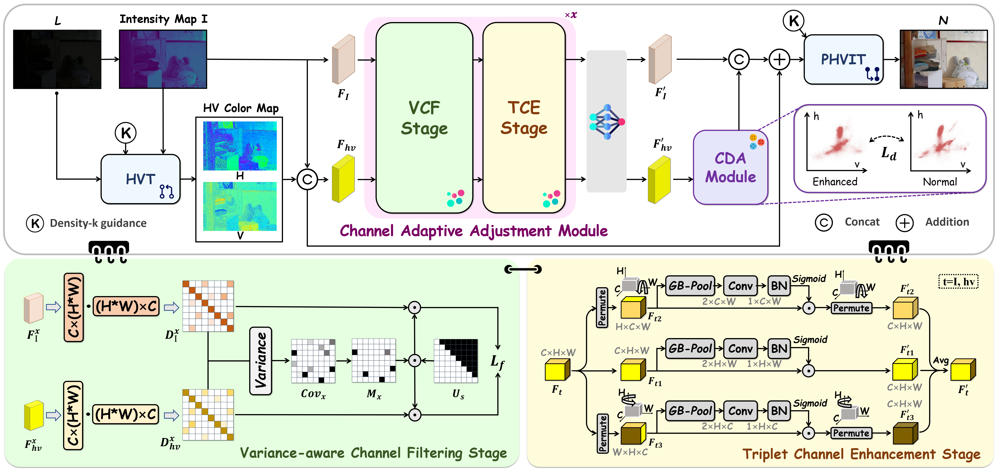

# Variance-aware Channel Recalibration Network for Low Light Image with Distribution Alignment

Official PyTorch implementation of **"Variance-aware Channel Recalibration Network for Low Light Image with Distribution Alignment"**.

## Overview

Low-light image enhancement in the sRGB space often suffers from the entanglement of luminance and chrominance, which may lead to unnatural brightness, color distortion, and unstable enhancement under challenging lighting conditions. To address these issues, we propose a **Variance-aware Channel Recalibration Network (VCR)** with **Distribution Alignment**, which improves channel-wise consistency between luminance and chrominance and further regularizes color distribution in the feature space.

Our framework consists of two key components:

- **Channel Adaptive Adjustment (CAA)**  
  - **Variance-aware Channel Filtering (VCF) Stage**: selectively suppresses channels with inconsistent luminance–chrominance distributions.
  - **Triplet Channel Enhancement (TCE) Stage**: enhances channel and spatial interactions through multi-branch rotated attention.

- **Color Distribution Alignment (CDA)**  
  Aligns the enhanced HV features with well-exposed references in the color feature space, leading to more natural and realistic enhancement results.

## Highlights

- A novel **variance-aware channel recalibration** framework for low-light image enhancement.
- Explicit modeling of **luminance–chrominance consistency** in the HVI space.
- A **distribution alignment objective** for improving color fidelity and perceptual realism.
- Strong performance on multiple paired and unpaired low-light benchmarks.

## Framework

  

The input image is first transformed into the **HVI color space**, and then processed by the proposed **CAA** module, which sequentially applies **VCF** and **TCE** for channel-wise filtering and enhancement. After feature recalibration, the model performs enhancement and aligns the chrominance distribution through the **CDA** module. Finally, the enhanced result is mapped back to the RGB space.
